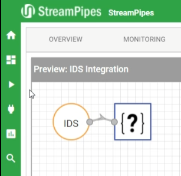
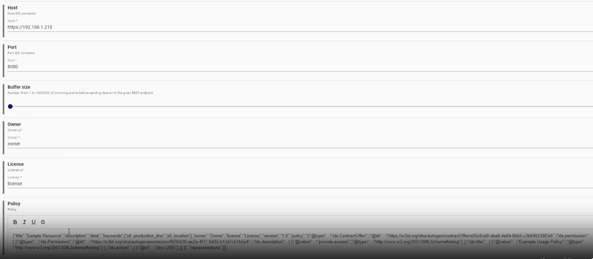
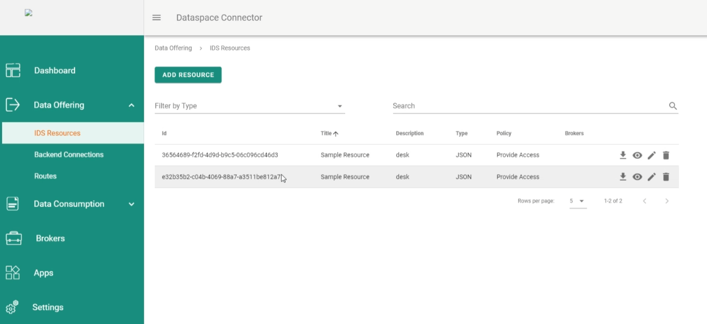

<!---
SPDX-FileCopyrightText: 2023 Siemens AG
SPDX-License-Identifier: Apache-2.0
-->
# StreamPipes IDS Publisher
This component extends Apache Pipes (https://streampipes.apache.org/) with connectivity to International Data Spaces Association (IDSA) Dataspace Connector (https://github.com/International-Data-Spaces-Association/DataspaceConnector)

 <cite> Apache StreamPipes is a self-service Industrial IoT toolbox to enable non-technical users to connect, analyze and explore IoT data streams. The main goal of StreamPipes is to help users bridging the gap between operational technology (OT) and information technology (IT). This is achieved by providing a set of tools which help to make industrial data accessible for downstream tasks such as data analytics and condition monitoring. When working with industrial data and especially when building upon an open source stack for such tasks, users are often faced with the management and integration of a variety of different tools for data connectivity, messaging & integration, data enrichment, data storage, visualization and analytics. This results in an increasing operational complexity and hardly manageable software stacks. Apache StreamPipes addresses this problem: It provides a complete toolbox with a variety of different tools to easily gather data from OT systems such as Programmatic Logic Controllers (PLCs), industrial protocols (e.g., OPC-UA or Modbus), IT protocols (e.g., MQTT) and others. Data is integrated in the form of live data streams. Based on connected data, StreamPipes provides another module called the pipeline editor, which can be used to apply real-time analytics algorithms on connected data stream. To this end, a library of pre-defined algorithms can be used. Out of the box, StreamPipes provides more than 100 pipeline elements tailored at manufacturing data analytics.</cite> https://streampipes.apache.org/docs/introduction

 This component extends Apache StreamPipes using its software development kit (SDK, https://streampipes.apache.org/docs/extend-tutorial-data-processors/) and provides an new pipeline element for publishing its input into IDSA Dataspace Connector.
 
<cite>THE INTERNATIONAL DATA SPACES (IDS) IS A VIRTUAL DATA SPACE LEVERAGING EXISTING STANDARDS AND
TECHNOLOGIES. Data sovereignty is a central aspect of the International Data Spaces. The International Data Spaces initiative proposes a Reference Architecture Model for this particular capability and related aspects, including requirements for secure and trusted data exchange in business ecosystems.</cite> https://internationaldataspaces.org/wp-content/uploads/IDS-Reference-Architecture-Model-3.0-2019.pdf
 
<cite>The Dataspace Connector is an implementation of an IDS connector component following the IDS Reference Architecture Model. It integrates the IDS Information Model and uses the IDS Messaging Services for IDS functionalities and message handling. The core component [...] provides a REST API for loading, updating, and deleting resources with local or remote data enriched by its metadata. It supports IDS conform message handling with other IDS connectors and components and implements usage control for selected IDS usage policy patterns. </cite> https://github.com/International-Data-Spaces-Association/DataspaceConnector
 
The pipeline element can be used with Stream Pipes v.0.68.0 (https://github.com/apache/streampipes/releases/tag/release%2F0.68.0) and publishes its data to the IDS Connector v6.0.0 (https://github.com/International-Data-Spaces-Association/DataspaceConnector/releases/tag/v6.0.0). The stream of input objects in the pipeline element is serialized in batches of JSON files (each input field in an attribute of JSON object, there is an JSON object per input object), each file is registred as a resource of the IDS connector through the connectors REST API. The URL to the destination IDS connector, the IDS usage policy (https://internationaldataspaces.org/wp-content/uploads/dlm_uploads/IDSA-Position-Paper-Usage-Control-in-the-IDS-V3..pdf) for the data as well as the batch size (how many input objects per file) can be configured in the StreamPipie pipeline editor visually (web based editor).

The new element can be used in a pipeline (shown with the {?} icon)




The visual configuration of the pipeline element is possible.




Resulting data in the target IDS Connector instance, a JSON file per batch, batch size configurable




Set your environment varible to point to the host running stream pipes
```
SP_HOST=<YOUR_HOST_RUNNING_STREAMPIPES>
```
Build and run
```
mvn package
docker build
docker run streampipesidspublisher -p localhost:8090:8090
```

The pipline element can now be used in Streampipes pipelines (https://streampipes.apache.org/docs/concepts-overview#pipeline) to publish data to an instance of an IDS connector.